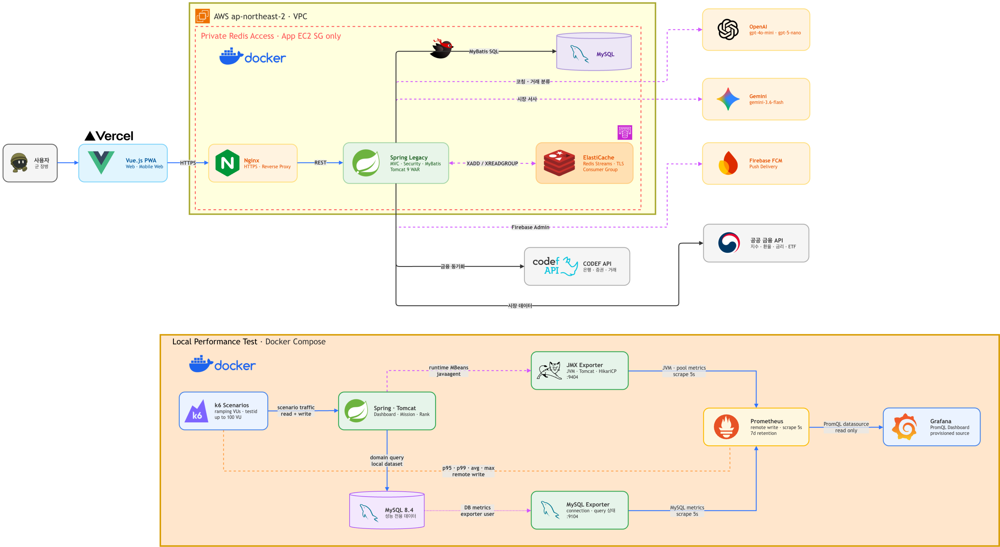

<div align="center">

# 🪖 제대로 (JaedaeRo)

### 군인의 확정소득 기반 AI 금융 성장 플랫폼

입대부터 전역, 그리고 사회초년생까지<br>
군인의 금융 생애주기를 연결하는 AI Financial Coach

> **제대로 모으고, 제대로 쓰고, 제대로 준비해서 진짜 제대로.**

</div>

---

## 📌 프로젝트 소개

병 봉급 인상과 장병내일준비적금 확대로 군 복무 기간은 생애 첫 규칙적인 소득과 저축을 경험하는 시기가 되었습니다. 하지만 기존 군인 금융 서비스는 조회와 정보 제공에 머무르는 경우가 많아, 현재의 선택이 전역 시점의 자산에 어떤 영향을 주는지 파악하기 어렵습니다.

**제대로**는 군인의 복무 정보와 확정된 미래 소득, 연동된 금융 데이터를 활용해 전역까지의 자산 흐름을 예측합니다. 소비·저축·투자 시나리오와 AI 분석, 챌린지를 통해 사용자가 전역 이후까지 지속할 수 있는 금융 습관을 만들도록 돕습니다.

## 🚀 핵심 기능

- **인증·온보딩**: Google·Kakao 소셜 로그인, JWT 인증, 군 복무 정보·투자 성향·목표 설정
- **금융 데이터 연동**: CODEF 기반 계좌·예적금·증권 자산·거래내역 동기화
- **확정소득 캐시플로우**: 입대일, 계급, 진급, 전역일, 봉급 정책을 반영한 월별 예상 자산 계산
- **대시보드·What-if 시뮬레이션**: 현재 자산, 전역 예상 자산, 소비·저축·투자 조정 결과와 이력 제공
- **AI Financial Coach**: 소비 패턴 분석, 추천 전략 적용, 적립식 투자 가이드, 오늘의 시장 리포트
- **챌린지·혜택**: 입대 동기 그룹 랭킹, 오늘의 미션, 투자 배지, 군인 혜택, 휴가 모드
- **알림·리포트**: Redis Streams 기반 알림 파이프라인, Firebase FCM 푸시, 전역 리포트

## 🏗️ 시스템 아키텍처



- Vue 3 PWA는 Vercel에서 제공되며 HTTPS로 AWS VPC 내 Nginx Reverse Proxy와 통신합니다.
- Spring Framework WAR 애플리케이션은 Tomcat 9에서 실행되고 MyBatis를 통해 MySQL에 접근합니다.
- AWS ElastiCache Redis Streams로 알림 이벤트를 처리하고 Firebase FCM으로 푸시 알림을 발송합니다.
- CODEF, 공공 금융 API, OpenAI 호환 LLM, Gemini API를 통해 금융 데이터와 AI 분석을 제공합니다.
- 로컬 성능 환경에서 k6, JMX Exporter, MySQL Exporter, Prometheus, Grafana로 부하와 메트릭을 검증합니다.

## 🛠 기술 스택

| 영역 | 기술 |
| --- | --- |
| Frontend | Vue 3, JavaScript, Vite, Pinia, Vue Router, Axios, Tailwind CSS, PWA |
| Backend | Java 17, Spring Framework 5.3, Spring MVC, Spring Security 5, OAuth 2.0, JWT, MyBatis |
| Data·Messaging | MySQL 8.4, HikariCP, Caffeine, Redis Streams, AWS ElastiCache |
| AI·External API | OpenAI Chat Completions 호환 LLM, Gemini Developer API, CODEF, KRX, FRED, Finnhub, 공공 금융 API, Firebase FCM |
| Deploy | Vercel, AWS EC2, VPC, Nginx, Docker, Docker Compose, Tomcat 9 WAR |
| Test·Monitoring | JUnit 5, Spring Test, k6, JMX Exporter, MySQL Exporter, Prometheus, Grafana |

## 🗂️ 저장소

| Repository | Description |
| --- | --- |
| [Jaedaero_frontend](https://github.com/BellongBellong/Jaedaero_frontend) | Vue 3 PWA 프론트엔드 |
| [Jaedaero_backend](https://github.com/BellongBellong/Jaedaero_backend) | Spring Framework MVC2 백엔드 |

```text
Jaedaero_frontend/
├── src/app/                 # 앱 진입·라우팅
├── src/common/              # 공통 API·유틸리티
├── src/features/            # 인증, 자산, 캐시플로우, AI, 챌린지 등
└── docs/                    # API·화면 데이터 계약

Jaedaero_backend/
├── src/main/java/com/jaedaero/
│   ├── global/              # Spring 설정, 보안, 예외, 배치
│   └── domain/              # 도메인별 Controller·Service·Mapper·DTO·VO
├── src/main/resources/mapper/ # MyBatis Mapper XML
├── sql/                       # 마이그레이션·시드
├── k6/                        # 성능 테스트 시나리오
└── monitoring/                # Prometheus·Grafana 설정
```

## 👨‍👩‍👧‍👦 Team

| 이름 | 역할 |
| --- | --- |
| 임도헌 | Front-End / 인증·온보딩·챌린지·마이페이지 |
| 주유정 | Front-End / AI Coach·시뮬레이션 |
| 최다래 | Front-End / UI/UX·대시보드·거래내역·알림 |
| 박성훈 | Back-End / 인증·회원·챌린지·보안·마이페이지 |
| 최윤호 | Back-End / 팀장·CODEF·자산·캐시플로우·상품추천 |
| 양승환 | Back-End / AI Coach·시뮬레이션·알림·LLM |

## 📅 프로젝트 기간

**KB IT's Your Life 7기 종합실무 프로젝트**<br>
2026.07 ~ 2026.08

---

<div align="center">

**제대로 가는 금융여정, 제대로.**

</div>
